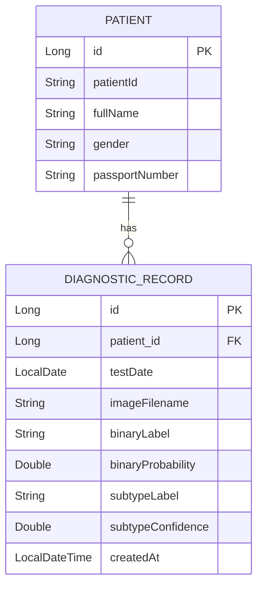

# Breast Cancer Detection & Patient Management System

A full-stack system that detects breast cancer from histopathology images using deep learning, and manages patient diagnostic records in a relational database.

## Architecture

```
Image ─▶ FastAPI (PyTorch models) ─▶ Spring Boot REST API ─▶ MySQL
                                              ▲
                                          Frontend
```

- **ML service (Python / FastAPI)** — serves two ResNet-18 models: a binary detector (benign vs malignant) and an 8-class subtype classifier.
- **Backend (Java / Spring Boot + JPA)** — patient data management, REST API, and a `/diagnose` endpoint that calls the ML service and persists the result.
- **Database** — MySQL.

## Models

Transfer learning (ResNet-18, ImageNet-pretrained) on the **BreakHis** dataset at 200× magnification, evaluated on a held-out test set. The binary model is threshold-tuned to prioritise **recall** (avoid missed malignancies); the subtype model adds detail. The benign/malignant decision is always taken from the binary model.

| Model | Task | Results |
|-------|------|---------|
| Binary detector | benign vs malignant | Accuracy **0.955** · malignant recall **1.00** |
| Subtype classifier | 8 histological subtypes | Accuracy **0.906** · macro-F1 **0.882** |

> Evaluated on an image-level split; a patient-level split is recommended for leakage-free benchmarking.

## Database schema



## API (selected)

| Method | Endpoint | Description |
|--------|----------|-------------|
| `POST` | `/api/patients` | Create a patient |
| `GET` | `/api/patients?q=&page=&size=` | Search + paginate patients |
| `GET` `PUT` `DELETE` | `/api/patients/{id}` | Get / update / delete a patient |
| `POST` | `/api/patients/{id}/diagnose` | Upload image → predict → save record |
| `GET` | `/api/patients/{id}/records` | List a patient's diagnostic records |

## Tech stack

Python · PyTorch · torchvision · FastAPI · Java · Spring Boot · Spring Data JPA · MySQL

## Run

```bash
# ML inference service
cd ml/service
pip install -r requirements.txt
uvicorn app:app --port 8000

# Backend (requires MySQL running on :3306)
cd backend
mvnw spring-boot:run
# Frontend
cd frontend/src
npm run dev
```

## Dataset

[BreakHis](https://web.inf.ufpr.br/vri/databases/breast-cancer-histopathological-database-breakhis/) — Breast Cancer Histopathological Database (200× magnification; binary and 8-class subtype labels).
